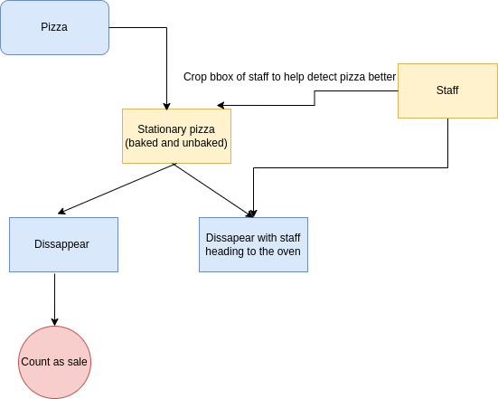

# Project: Pixxa Count

## Overview
Pixxa Count is an advanced computer vision application designed to count pizza sales by tracking customer interactions and transactions. The system uses Region of Interest (ROI) detection, enhanced people tracking, and sophisticated video processing to provide insights into sales patterns and customer behavior at pizza establishments.

## Features
- People/Pizza Tracking
- Handle occlusion
- Enhance pizza tracking through ROI, enhancing light with LAB, CLAHE

## System Architecture




## Project Structure
```
pixxa_count/
├── app/
│   ├── static/                  # Frontend assets
│   │   ├── css/                 # Styling
│   │   ├── js/                  # JavaScript for interactivity
│   └── templates/               # HTML templates
│       └── index.html           # Main UI with ROI selection
├── app/helper/                  # Core tracking logic
│   ├── TrackerConfig.py         # Configuration parameters
│   ├── trackedObject.py         # Object tracking data classes
│   ├── pizzaTracker.py          # Main tracking algorithms
│   └── __init__.py              # Package initialization
├── data/                        # Uploaded and processed videos
│   ├── uploads/                 # User uploaded videos
│   ├── output/                  # Processed videos with tracking
│   └── sample_video.mp4         # Example video
├── image/                       # Documentation images
│   └── diagram.png              # System architecture diagram
├── app/video_processing.py      # Video processing with ROI
├── app/server.py                # Flask backend with ROI handling
├── Dockerfile                   # Docker setup
├── docker-compose.yml           # Compose services
├── requirements.txt             # Python dependencies
└── README.md                    # This file
```

## Requirements
- Python 3.10+
- Docker & Docker Compose
- Flask
- OpenCV
- Ultralytics YOLO
- NumPy
- SciPy
- Scikit-image

## Installation

1. Clone the repository:
   ```bash
   git clone https://github.com/hoangtrungnguyen1010/pizza_sale_tracking.git
   cd pizza_sale_tracking
   ```

2. Build the Docker container:
   ```bash
   docker-compose build
   ```

3. Start the application:
   ```bash
   docker-compose up
   ```

4. Access the application in your browser:
   ```
   http://localhost:5000
   ```

## Usage

### 1. **Upload Video**
   - Select a video file showing the sales/counter area
   - Supported format: MP4
   - Video should clearly show customer interactions at the counter

### 2. **Define Oven Area **
   - Draw a rectangle around the Oven area by clicking and dragging
   - The ROI defines the area where customer visits will be tracked
   - Ensure the rectangle covers the entire sales interaction area

### 3. **Start Tracking**
   - Click "Start Sales Tracking" to begin analysis
   - The system will process the video with ROI-based detection
   - Real-time tracking overlay shows customer movements


## License
MIT License

## Contributing
Contributions are welcome! Please feel free to submit pull requests or open issues for bugs and feature requests.
